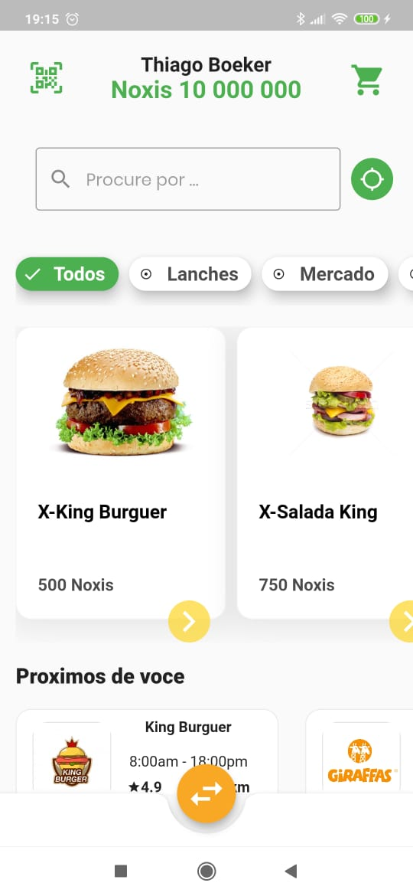

# Noxi

Projeto no segmento de e-commerce para pontos de fidelidade. O objetivo é desburocratizar
a vida do cliente que busca mais vantagens na hora de comprar e para o vendedor que
deseja manter ou expandir sua base de clientes.

# O App

Nosso app esta sendo desenvolvido em Flutter. Alguns dos motivos
para nossa escolha listados abaixo.

    - Hibrido
    - Dart(Linguagem mais concisa e tipada)
    - Bom uso de conceitos reativos
    - Material Design por padrao

# O Design

Para a identidade do nosso App optamos por um layout mais simples,
minimalista e suave.

A paleta de cores apresenta essa suavidade e o constraste com o laranja nos ajuda a destacar algumas coisas e ainda assim manter a suavidade.

# Conclusao

Flutter é uma plataforma fantastica. E modéstia parte nosso layout ficou muito bom, nós amamos o resultado.
